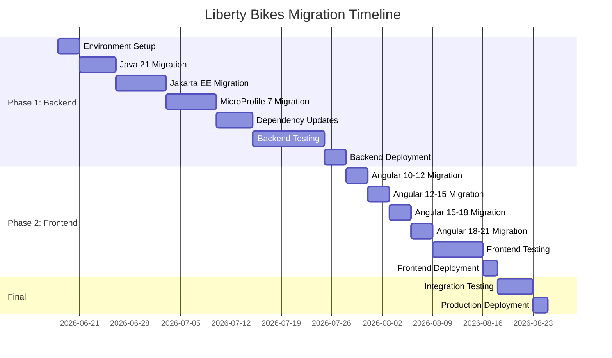

# Liberty Bikes Migration Plan - Part 2
## Testing, Timeline, Rollback, and Risk Assessment

---

## 7. Comprehensive Test Plan (Continued)

### 7.3 Phase 2: Frontend Testing (Continued)

#### 7.3.1 Unit Testing (Jasmine/Karma)

**Service Tests:**

```typescript
describe('GameService', () => {
  let service: GameService;
  let httpMock: HttpTestingController;

  beforeEach(() => {
    TestBed.configureTestingModule({
      imports: [HttpClientTestingModule],
      providers: [GameService]
    });
    
    service = TestBed.inject(GameService);
    httpMock = TestBed.inject(HttpTestingController);
  });

  afterEach(() => {
    httpMock.verify();
  });

  it('should fetch game state', () => {
    const mockState = { players: [], obstacles: [] };
    
    service.getGameState('test-round').subscribe(state => {
      expect(state).toEqual(mockState);
    });
    
    const req = httpMock.expectOne('/game-service/round/test-round');
    expect(req.request.method).toBe('GET');
    req.flush(mockState);
  });
});
```

#### 7.3.2 Integration Testing

**Component Integration:**

```typescript
describe('Game Integration', () => {
  it('should display players in game', fakeAsync(() => {
    const fixture = TestBed.createComponent(GameComponent);
    const compiled = fixture.nativeElement;
    
    fixture.detectChanges();
    tick();
    
    const playerElements = compiled.querySelectorAll('.player');
    expect(playerElements.length).toBeGreaterThan(0);
  }));
});
```

#### 7.3.3 E2E Testing (Cypress)

**Replace Protractor with Cypress:**

```bash
npm install --save-dev cypress
```

**Cypress Test Example:**

```typescript
describe('Liberty Bikes E2E', () => {
  beforeEach(() => {
    cy.visit('/');
  });

  it('should display login page', () => {
    cy.contains('Liberty Bikes');
    cy.get('button').contains('Login with GitHub').should('be.visible');
  });

  it('should navigate to game after login', () => {
    // Mock authentication
    cy.window().then((win) => {
      win.localStorage.setItem('jwt', 'mock-token');
    });
    
    cy.visit('/game');
    cy.get('.game-board').should('be.visible');
  });

  it('should handle player movement', () => {
    cy.visit('/game/test-round');
    
    // Simulate key press
    cy.get('body').type('{uparrow}');
    
    // Verify player moved
    cy.get('.player').should('have.attr', 'data-direction', 'UP');
  });
});
```

### 7.4 Regression Testing

**Critical Functionality Checklist:**

- [ ] User authentication (GitHub, Google, Twitter)
- [ ] JWT token generation and validation
- [ ] Player creation and retrieval
- [ ] Player ranking calculation
- [ ] Game round creation
- [ ] WebSocket connection establishment
- [ ] Player movement in game
- [ ] Collision detection
- [ ] AI player behavior
- [ ] Game state synchronization
- [ ] Leaderboard display
- [ ] Database fallback mechanism
- [ ] CORS configuration
- [ ] Metrics collection
- [ ] OpenAPI documentation

**Regression Test Suite:**

```java
@TestSuite
public class RegressionTests {
    @Test
    void testCompleteGameFlow() {
        // 1. Authenticate user
        String jwt = authenticateUser("test-user");
        assertNotNull(jwt);
        
        // 2. Create player
        Player player = createPlayer(jwt, "Test Player");
        assertEquals("Test Player", player.getName());
        
        // 3. Join game
        String roundId = joinGame(jwt, player.getId());
        assertNotNull(roundId);
        
        // 4. Play game
        playGame(jwt, roundId, player.getId());
        
        // 5. Verify stats updated
        PlayerStats stats = getPlayerStats(player.getId());
        assertTrue(stats.getGamesPlayed() > 0);
    }
}
```

### 7.5 Performance Testing

**Performance Benchmarks:**

| Metric | Current (Java 8) | Target (Java 21) | Tolerance |
|--------|------------------|------------------|-----------|
| API Response Time (p95) | <100ms | <100ms | ±10% |
| WebSocket Latency | <50ms | <50ms | ±10% |
| Game Tick Rate | 50ms | 50ms | ±5% |
| Memory Usage (heap) | ~512MB | <512MB | -20% |
| Startup Time | ~15s | <15s | -30% |
| Concurrent Users | 100 | 100+ | +20% |

**Performance Test Script:**

```java
@Test
void testApiPerformance() {
    long startTime = System.currentTimeMillis();
    
    for (int i = 0; i < 1000; i++) {
        Response response = given()
            .when()
            .get("/player-service/players/test-player")
            .then()
            .statusCode(200)
            .extract().response();
    }
    
    long endTime = System.currentTimeMillis();
    long avgTime = (endTime - startTime) / 1000;
    
    assertTrue(avgTime < 100, "Average response time should be < 100ms");
}
```

**Load Testing (JMeter/Gatling):**

```scala
// Gatling scenario
val scn = scenario("Game Load Test")
  .exec(http("Join Game")
    .post("/game-service/round/test-round/join")
    .header("Authorization", "Bearer ${jwt}")
    .check(status.is(200)))
  .pause(1)
  .repeat(100) {
    exec(http("Send Movement")
      .ws("Connect")
      .sendText("""{"direction": "UP"}""")
      .await(1)(ws.checkTextMessage("check").check(jsonPath("$.players").exists)))
  }

setUp(
  scn.inject(rampUsers(100) during (60 seconds))
).protocols(httpProtocol)
```

### 7.6 Security Testing

**Security Test Checklist:**

- [ ] JWT token validation
- [ ] Token expiration handling
- [ ] CORS configuration
- [ ] SQL injection prevention
- [ ] XSS prevention
- [ ] CSRF protection
- [ ] Secure WebSocket connections
- [ ] OAuth callback validation
- [ ] Keystore security
- [ ] Environment variable protection

**Security Test Examples:**

```java
@Test
void testJwtExpiration() {
    // Create expired token
    String expiredJwt = createExpiredJwt();
    
    Response response = given()
        .header("Authorization", "Bearer " + expiredJwt)
        .when()
        .get("/player-service/players/me")
        .then()
        .statusCode(401)
        .extract().response();
}

@Test
void testSqlInjection() {
    String maliciousInput = "'; DROP TABLE players; --";
    
    Response response = given()
        .queryParam("name", maliciousInput)
        .when()
        .get("/player-service/players/search")
        .then()
        .statusCode(400)
        .extract().response();
}
```

### 7.7 Compatibility Testing

**Browser Compatibility Matrix:**

| Browser | Version | Status |
|---------|---------|--------|
| Chrome | Latest 2 | ✓ Required |
| Firefox | Latest 2 | ✓ Required |
| Safari | Latest 2 | ✓ Required |
| Edge | Latest 2 | ✓ Required |

**Test Scenarios:**
- WebSocket support
- Canvas rendering
- Local storage
- Service workers
- ES2022 features

---

## 8. Timeline & Phases

### 8.1 Overall Timeline

**Total Duration: 8-12 weeks**



### 8.2 Phase 1: Backend Migration (6-8 weeks)

#### Week 1: Environment Setup & Planning
**Days 1-3:**
- Set up migration branch
- Configure Java 21 development environment
- Update CI/CD pipelines
- Create backup of current state

**Days 4-5:**
- Run automated dependency analysis
- Create detailed task breakdown
- Set up test environments

#### Week 2: Java 21 & Build System
**Days 1-3:**
- Update Gradle to 8.12
- Update Liberty Gradle Plugin to 3.x
- Configure Java 21 toolchain
- Update build scripts

**Days 4-5:**
- Run initial builds
- Fix compilation errors
- Update Docker configurations

#### Week 3: Jakarta EE Namespace Migration
**Days 1-2:**
- Run Eclipse Transformer on codebase
- Manual review of transformed code

**Days 3-5:**
- Update all `javax.*` to `jakarta.*`
- Update server.xml configurations
- Fix import issues
- Run unit tests

#### Week 4: MicroProfile 7 Migration
**Days 1-3:**
- Update MicroProfile dependencies
- Update Liberty features in server.xml
- Test MicroProfile Config
- Test MicroProfile JWT

**Days 4-5:**
- Test MicroProfile Rest Client
- Test MicroProfile Fault Tolerance
- Test MicroProfile Metrics
- Test MicroProfile OpenAPI

#### Week 5: Critical Dependencies
**Days 1-2:**
- Migrate JJWT 0.9.1 → 0.12.6
- Update JWT generation code
- Update JWT validation code

**Days 3-4:**
- Update PostgreSQL driver
- Update Google API client
- Update other dependencies

**Day 5:**
- Resolve dependency conflicts
- Run full build

#### Week 6-7: Testing
**Week 6:**
- Unit testing (all services)
- Integration testing (REST APIs)
- WebSocket testing
- Database testing

**Week 7:**
- Performance testing
- Security testing
- Regression testing
- Fix identified issues

#### Week 8: Deployment
**Days 1-2:**
- Deploy to staging environment
- Run smoke tests
- Performance validation

**Day 3:**
- Production deployment (backend only)
- Monitor metrics
- Verify functionality

### 8.3 Phase 2: Frontend Migration (2-4 weeks)

#### Week 9: Angular 10-15
**Days 1-2:**
- Angular 10 → 12 migration
- Run tests, fix issues

**Days 3-4:**
- Angular 12 → 13 migration
- Update RxJS patterns

**Day 5:**
- Angular 13 → 15 migration
- Test with migrated backend

#### Week 10: Angular 15-21
**Days 1-2:**
- Angular 15 → 17 migration
- Test new features

**Days 3-4:**
- Angular 17 → 19 migration
- Angular 19 → 21 migration

**Day 5:**
- Replace TSLint with ESLint
- Update Bootstrap 4 → 5

#### Week 11: Frontend Testing
**Days 1-3:**
- Unit testing (components/services)
- Integration testing
- E2E testing with Cypress

**Days 4-5:**
- Cross-browser testing
- Performance testing
- Fix identified issues

#### Week 12: Final Integration & Deployment
**Days 1-3:**
- Full stack integration testing
- User acceptance testing
- Performance validation

**Days 4-5:**
- Production deployment (frontend)
- Monitor metrics
- Post-deployment validation

---

## 9. Rollback Procedures

### 9.1 Rollback Strategy

**Principle**: Each phase must be independently rollback-able.

### 9.2 Phase 1: Backend Rollback

#### 9.2.1 Pre-Deployment Checklist

- [ ] Current production state documented
- [ ] Database backup created
- [ ] Configuration files backed up
- [ ] Rollback script tested
- [ ] Rollback decision criteria defined

#### 9.2.2 Rollback Triggers

**Automatic Rollback:**
- Service startup failure
- Health check failure > 5 minutes
- Error rate > 5%
- Response time degradation > 50%

**Manual Rollback:**
- Critical functionality broken
- Data corruption detected
- Security vulnerability discovered

#### 9.2.3 Rollback Procedure

**Step 1: Stop New Services**
```bash
# Stop Liberty 26 services
./gradlew libertyStop

# Or via Docker
docker-compose down
```

**Step 2: Restore Previous Version**
```bash
# Checkout previous version
git checkout production-backup

# Rebuild with Java 8
export JAVA_HOME=/path/to/java8
./gradlew clean build

# Deploy
./gradlew libertyStart
```

**Step 3: Verify Rollback**
```bash
# Check service health
curl http://localhost:8080/health

# Verify functionality
./run-smoke-tests.sh
```

**Step 4: Database Rollback (if needed)**
```sql
-- Restore from backup
pg_restore -d playerdb backup.dump

-- Or rollback migrations
flyway undo
```

#### 9.2.4 Rollback Time Estimate

- **Automated rollback**: 5-10 minutes
- **Manual rollback**: 15-30 minutes
- **With database restore**: 30-60 minutes

### 9.3 Phase 2: Frontend Rollback

#### 9.3.1 Rollback Procedure

**Step 1: Revert Frontend Deployment**
```bash
# Checkout previous version
git checkout frontend-backup

# Rebuild with Angular 10
cd frontend/prebuild
npm install
npm run build

# Deploy
./gradlew frontend:libertyStart
```

**Step 2: Clear CDN Cache**
```bash
# Invalidate CloudFront/CDN cache
aws cloudfront create-invalidation --distribution-id XXX --paths "/*"
```

**Step 3: Verify Rollback**
- Test login flow
- Test game functionality
- Verify WebSocket connection

#### 9.3.2 Rollback Time Estimate

- **Frontend only**: 10-15 minutes
- **With CDN cache clear**: 15-20 minutes

### 9.4 Rollback Decision Matrix

| Issue | Severity | Action | Timeline |
|-------|----------|--------|----------|
| Service won't start | CRITICAL | Immediate rollback | < 5 min |
| Error rate > 10% | CRITICAL | Immediate rollback | < 10 min |
| Performance degradation > 50% | HIGH | Rollback if not fixed in 30 min | < 30 min |
| Minor UI issues | MEDIUM | Fix forward | N/A |
| Non-critical bugs | LOW | Fix forward | N/A |

### 9.5 Post-Rollback Actions

1. **Root Cause Analysis**
   - Document what went wrong
   - Identify prevention measures
   - Update migration plan

2. **Communication**
   - Notify stakeholders
   - Update status page
   - Document lessons learned

3. **Re-Planning**
   - Address identified issues
   - Update timeline
   - Schedule retry

---

## 10. Environment Considerations

### 10.1 Development Environment

**Requirements:**
- Java 21 JDK installed
- Node.js 20+ for Angular 21
- Gradle 8.12+
- Docker Desktop
- PostgreSQL 16 (or Docker container)

**Setup Script:**
```bash
#!/bin/bash
# setup-dev-env.sh

# Install Java 21
sdk install java 21.0.1-tem
sdk use java 21.0.1-tem

# Install Node.js 20
nvm install 20
nvm use 20

# Update Gradle wrapper
./gradlew wrapper --gradle-version 8.12

# Install dependencies
./gradlew build
cd frontend/prebuild && npm install

# Start PostgreSQL
docker run -d \
  --name liberty-bikes-postgres \
  -e POSTGRES_DB=playerdb \
  -e POSTGRES_USER=lb_user \
  -e POSTGRES_PASSWORD=lb_password \
  -p 5432:5432 \
  postgres:16-alpine
```

**IDE Configuration:**
- IntelliJ IDEA: Set Project SDK to Java 21
- VS Code: Install Java Extension Pack, configure java.home
- Eclipse: Install Java 21 support, configure workspace

### 10.2 Staging Environment

**Configuration:**
- Mirror production setup
- Use separate database instance
- Enable debug logging
- Configure monitoring

**Environment Variables:**
```bash
# Staging-specific
ENVIRONMENT=staging
LOG_LEVEL=DEBUG
DB_HOST=staging-postgres.internal
FRONTEND_URL=https://staging.libertybikes.com
AUTH_URL=https://staging-auth.libertybikes.com

# OAuth (use test credentials)
GITHUB_CLIENT_ID=staging-github-id
GITHUB_CLIENT_SECRET=staging-github-secret
GOOGLE_CLIENT_ID=staging-google-id
GOOGLE_CLIENT_SECRET=staging-google-secret
```

**Deployment Process:**
```bash
# Deploy to staging
./gradlew clean build
docker-compose -f docker-compose.staging.yml up -d

# Run smoke tests
./run-smoke-tests.sh staging

# Run full test suite
./run-integration-tests.sh staging
```

### 10.3 Production Environment

**Configuration:**
- High availability setup
- Load balancing
- Auto-scaling
- Production monitoring
- Backup and disaster recovery

**Environment Variables:**
```bash
# Production
ENVIRONMENT=production
LOG_LEVEL=INFO
DB_HOST=prod-postgres.internal
DB_POOL_SIZE=20
FRONTEND_URL=https://libertybikes.com
AUTH_URL=https://auth.libertybikes.com

# OAuth (production credentials)
GITHUB_CLIENT_ID=prod-github-id
GITHUB_CLIENT_SECRET=prod-github-secret
GOOGLE_CLIENT_ID=prod-google-id
GOOGLE_CLIENT_SECRET=prod-google-secret

# Performance tuning
JAVA_OPTS="-Xmx2g -Xms2g -XX:+UseG1GC -XX:+UseStringDeduplication"
```

**Deployment Strategy:**
- Blue-green deployment
- Canary releases (10% → 50% → 100%)
- Automated rollback on failure

**Monitoring:**
- Prometheus metrics
- Grafana dashboards
- Application logs (ELK stack)
- APM (Application Performance Monitoring)
- Uptime monitoring

### 10.4 CI/CD Pipeline Updates

**GitHub Actions / Jenkins Pipeline:**

```yaml
name: Liberty Bikes CI/CD

on:
  push:
    branches: [main, develop]
  pull_request:
    branches: [main]

jobs:
  backend-build:
    runs-on: ubuntu-latest
    steps:
      - uses: actions/checkout@v3
      
      - name: Set up Java 21
        uses: actions/setup-java@v3
        with:
          java-version: '21'
          distribution: 'temurin'
      
      - name: Build with Gradle
        run: ./gradlew build
      
      - name: Run tests
        run: ./gradlew test
      
      - name: Build Docker images
        run: docker-compose build
  
  frontend-build:
    runs-on: ubuntu-latest
    steps:
      - uses: actions/checkout@v3
      
      - name: Set up Node.js 20
        uses: actions/setup-node@v3
        with:
          node-version: '20'
      
      - name: Install dependencies
        run: cd frontend/prebuild && npm ci
      
      - name: Run tests
        run: cd frontend/prebuild && npm test
      
      - name: Build
        run: cd frontend/prebuild && npm run build
  
  deploy-staging:
    needs: [backend-build, frontend-build]
    if: github.ref == 'refs/heads/develop'
    runs-on: ubuntu-latest
    steps:
      - name: Deploy to staging
        run: ./deploy-staging.sh
  
  deploy-production:
    needs: [backend-build, frontend-build]
    if: github.ref == 'refs/heads/main'
    runs-on: ubuntu-latest
    steps:
      - name: Deploy to production
        run: ./deploy-production.sh
```

### 10.5 Database Migration Strategy

**Flyway Configuration:**

```sql
-- V1__baseline.sql (current state)
-- Baseline schema

-- V2__java21_migration.sql (if needed)
-- Any schema changes for Java 21 compatibility

-- V3__microprofile7_migration.sql (if needed)
-- Any schema changes for MicroProfile 7
```

**Migration Script:**
```bash
#!/bin/bash
# migrate-database.sh

# Backup current database
pg_dump -h $DB_HOST -U $DB_USER -d playerdb > backup_$(date +%Y%m%d_%H%M%S).sql

# Run Flyway migrations
flyway -url=jdbc:postgresql://$DB_HOST/playerdb \
       -user=$DB_USER \
       -password=$DB_PASSWORD \
       migrate

# Verify migration
flyway -url=jdbc:postgresql://$DB_HOST/playerdb \
       -user=$DB_USER \
       -password=$DB_PASSWORD \
       info
```

---

## 11. Risk Assessment

### 11.1 Risk Matrix

| Risk | Probability | Impact | Severity | Mitigation |
|------|-------------|--------|----------|------------|
| Jakarta namespace migration errors | HIGH | HIGH | CRITICAL | Automated tools, thorough testing |
| JJWT API breaking changes | MEDIUM | HIGH | HIGH | Code review, integration tests |
| Performance degradation | LOW | HIGH | MEDIUM | Performance testing, monitoring |
| WebSocket compatibility issues | LOW | MEDIUM | MEDIUM | Protocol testing, fallback plan |
| Angular breaking changes | MEDIUM | MEDIUM | MEDIUM | Incremental migration, testing |
| Dependency conflicts | MEDIUM | MEDIUM | MEDIUM | Dependency analysis, resolution strategy |
| Database migration issues | LOW | HIGH | MEDIUM | Backup strategy, rollback plan |
| OAuth provider compatibility | LOW | MEDIUM | LOW | Test with all providers |
| Production deployment failure | LOW | CRITICAL | HIGH | Blue-green deployment, rollback |
| Team knowledge gaps | MEDIUM | MEDIUM | MEDIUM | Training, documentation |

### 11.2 Detailed Risk Analysis

#### Risk 1: Jakarta Namespace Migration Errors

**Description**: Incomplete or incorrect migration from `javax.*` to `jakarta.*` namespaces.

**Probability**: HIGH (38 files affected)

**Impact**: HIGH (Application won't compile or run)

**Mitigation Strategies:**
1. Use Eclipse Transformer for automated migration
2. Create comprehensive test suite before migration
3. Use IDE find-replace with verification
4. Peer review all changes
5. Run full test suite after migration

**Contingency Plan:**
- Maintain separate branch for namespace migration
- Test in isolated environment first
- Have rollback script ready

#### Risk 2: JJWT API Breaking Changes

**Description**: JJWT 0.9.1 → 0.12.6 has significant API changes.

**Probability**: MEDIUM (Known breaking changes)

**Impact**: HIGH (Authentication will fail)

**Mitigation Strategies:**
1. Review JJWT migration guide
2. Update all JWT creation/validation code
3. Create comprehensive JWT tests
4. Test with real OAuth providers
5. Verify token compatibility

**Contingency Plan:**
- Keep old JJWT version in separate branch
- Test token interoperability
- Have authentication fallback mechanism

#### Risk 3: Performance Degradation

**Description**: New versions may have different performance characteristics.

**Probability**: LOW (Java 21 generally faster)

**Impact**: HIGH (User experience affected)

**Mitigation Strategies:**
1. Establish performance baselines
2. Run performance tests before/after
3. Monitor metrics in staging
4. Use Java 21 performance features (virtual threads)
5. Profile application under load

**Contingency Plan:**
- Performance tuning guide ready
- JVM tuning parameters prepared
- Rollback if degradation > 20%

#### Risk 4: WebSocket Compatibility Issues

**Description**: WebSocket protocol changes between versions.

**Probability**: LOW (Protocol stable)

**Impact**: MEDIUM (Real-time game affected)

**Mitigation Strategies:**
1. Test WebSocket connections thoroughly
2. Verify message format compatibility
3. Test with multiple concurrent connections
4. Monitor WebSocket metrics
5. Have fallback to polling if needed

**Contingency Plan:**
- WebSocket protocol documentation
- Fallback to HTTP polling
- Client-side retry logic

#### Risk 5: Angular Breaking Changes

**Description**: Multiple major Angular versions with breaking changes.

**Probability**: MEDIUM (11 major versions)

**Impact**: MEDIUM (UI may break)

**Mitigation Strategies:**
1. Incremental migration (one version at a time)
2. Use `ng update` automated migrations
3. Comprehensive component testing
4. Visual regression testing
5. Cross-browser testing

**Contingency Plan:**
- Keep Angular 10 version in separate branch
- Test each migration step independently
- Rollback to previous version if issues

#### Risk 6: Dependency Conflicts

**Description**: Transitive dependencies may conflict.

**Probability**: MEDIUM (Many dependencies)

**Impact**: MEDIUM (Build failures)

**Mitigation Strategies:**
1. Use Gradle dependency resolution
2. Force specific versions where needed
3. Exclude conflicting transitive dependencies
4. Test with dependency tree analysis
5. Document all dependency decisions

**Contingency Plan:**
- Dependency conflict resolution guide
- Alternative library options identified
- Version compatibility matrix

#### Risk 7: Database Migration Issues

**Description**: Schema changes or data migration problems.

**Probability**: LOW (Minimal schema changes expected)

**Impact**: HIGH (Data loss possible)

**Mitigation Strategies:**
1. Always backup before migration
2. Test migrations in staging first
3. Use Flyway for versioned migrations
4. Verify data integrity after migration
5. Have rollback scripts ready

**Contingency Plan:**
- Database backup and restore procedures
- Point-in-time recovery capability
- Data validation scripts

#### Risk 8: Production Deployment Failure

**Description**: Deployment to production fails or causes outage.

**Probability**: LOW (With proper testing)

**Impact**: CRITICAL (Service unavailable)

**Mitigation Strategies:**
1. Blue-green deployment strategy
2. Canary releases (gradual rollout)
3. Automated health checks
4. Automated rollback on failure
5. Comprehensive pre-deployment testing

**Contingency Plan:**
- Immediate rollback procedure (< 5 minutes)
- Communication plan for stakeholders
- Post-mortem and improvement process

#### Risk 9: Team Knowledge Gaps

**Description**: Team unfamiliar with new technologies.

**Probability**: MEDIUM (New versions, new features)

**Impact**: MEDIUM (Slower development, potential errors)

**Mitigation Strategies:**
1. Training sessions on Java 21 features
2. Angular 21 workshop
3. MicroProfile 7 documentation review
4. Pair programming during migration
5. Knowledge sharing sessions

**Contingency Plan:**
- External consultants available
- Extended timeline if needed
- Mentoring program

### 11.3 Risk Monitoring

**Key Metrics to Monitor:**
- Build success rate
- Test pass rate
- Code coverage
- Performance metrics
- Error rates
- Deployment success rate

**Weekly Risk Review:**
- Review risk status
- Update mitigation strategies
- Identify new risks
- Adjust timeline if needed

---

## 12. Documentation Updates

### 12.1 Technical Documentation

**Documents to Update:**

1. **README.md**
   - Update Java version requirement
   - Update Node.js version requirement
   - Update build instructions
   - Update deployment instructions

2. **CONTRIBUTING.md**
   - Update development setup
   - Update coding standards
   - Update testing requirements

3. **API Documentation**
   - Update OpenAPI specifications
   - Update endpoint examples
   - Update authentication flow

4. **Architecture Documentation**
   - Update technology stack diagram
   - Update deployment architecture
   - Update dependency diagram

### 12.2 Developer Documentation

**New Documents to Create:**

1. **MIGRATION_GUIDE.md**
   - Step-by-step migration instructions
   - Common issues and solutions
   - Rollback procedures

2. **JAVA21_FEATURES.md**
   - Java 21 features used in codebase
   - Best practices
   - Code examples

3. **ANGULAR21_GUIDE.md**
   - Angular 21 features
   - Migration notes
   - Component patterns

4. **TESTING_GUIDE.md**
   - Test strategy
   - Running tests
   - Writing new tests

### 12.3 Operations Documentation

**Documents to Update:**

1. **DEPLOYMENT.md**
   - Updated deployment procedures
   - Environment configuration
   - Monitoring setup

2. **TROUBLESHOOTING.md**
   - Common issues
   - Debug procedures
   - Log analysis

3. **MONITORING.md**
   - Metrics to monitor
   - Alert thresholds
   - Dashboard setup

### 12.4 User Documentation

**Documents to Update:**

1. **User Guide**
   - Any UI changes
   - New features
   - Browser requirements

2. **FAQ**
   - Migration-related questions
   - Compatibility information

---

## 13. Success Criteria

### 13.1 Technical Success Criteria

- [ ] All services build successfully with Java 21
- [ ] All tests pass (unit, integration, E2E)
- [ ] Code coverage maintained or improved (>80%)
- [ ] No critical security vulnerabilities
- [ ] Performance metrics within acceptable range
- [ ] All deprecated features replaced
- [ ] Documentation updated

### 13.2 Functional Success Criteria

- [ ] User authentication works (all providers)
- [ ] Game functionality unchanged
- [ ] WebSocket communication stable
- [ ] Database operations functional
- [ ] Metrics collection working
- [ ] API documentation accurate

### 13.3 Operational Success Criteria

- [ ] Deployment successful in all environments
- [ ] Monitoring and alerting configured
- [ ] Rollback procedures tested
- [ ] Team trained on new versions
- [ ] Documentation complete

### 13.4 Business Success Criteria

- [ ] Zero downtime during migration
- [ ] No user-facing issues
- [ ] Performance maintained or improved
- [ ] Technical debt reduced
- [ ] Future-proofed for 3+ years

---

## 14. Conclusion

This comprehensive migration plan provides a structured approach to upgrading the Liberty Bikes application to modern technology versions while maintaining zero functional changes. The phased hybrid approach minimizes risk by isolating backend and frontend migrations, allowing for independent testing and rollback.

**Key Takeaways:**

1. **Phased Approach**: Backend first, then frontend
2. **Thorough Testing**: Comprehensive test plan at every stage
3. **Risk Mitigation**: Identified risks with mitigation strategies
4. **Rollback Ready**: Clear rollback procedures for each phase
5. **Documentation**: Complete documentation updates

**Next Steps:**

1. Review and approve this migration plan
2. Set up development environment with Java 21
3. Create migration branch
4. Begin Phase 1: Backend Migration
5. Regular progress reviews and risk assessments

**Timeline Summary:**
- Phase 1 (Backend): 6-8 weeks
- Phase 2 (Frontend): 2-4 weeks
- Total: 8-12 weeks

**Contact:**
For questions or concerns about this migration plan, contact the migration team.

---

**Document Version:** 1.0  
**Last Updated:** 2026-06-18  
**Status:** Ready for Review