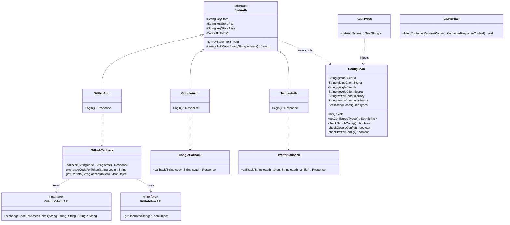
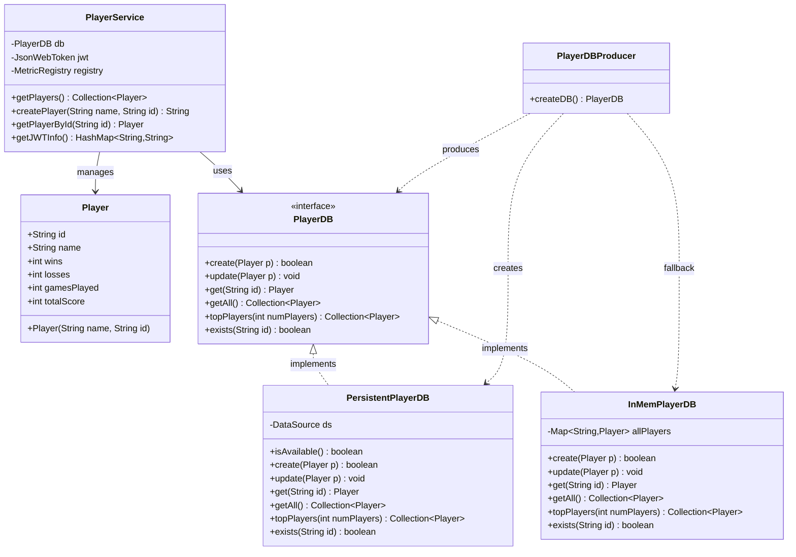
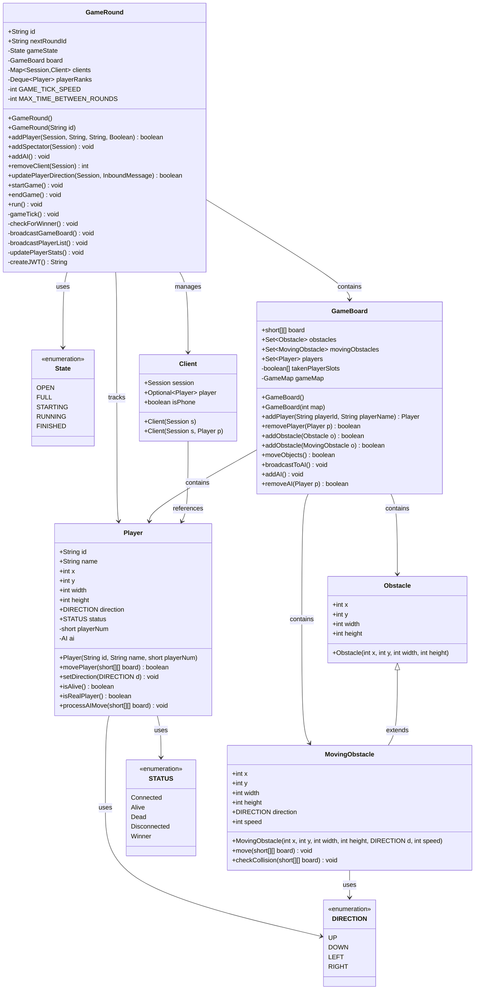
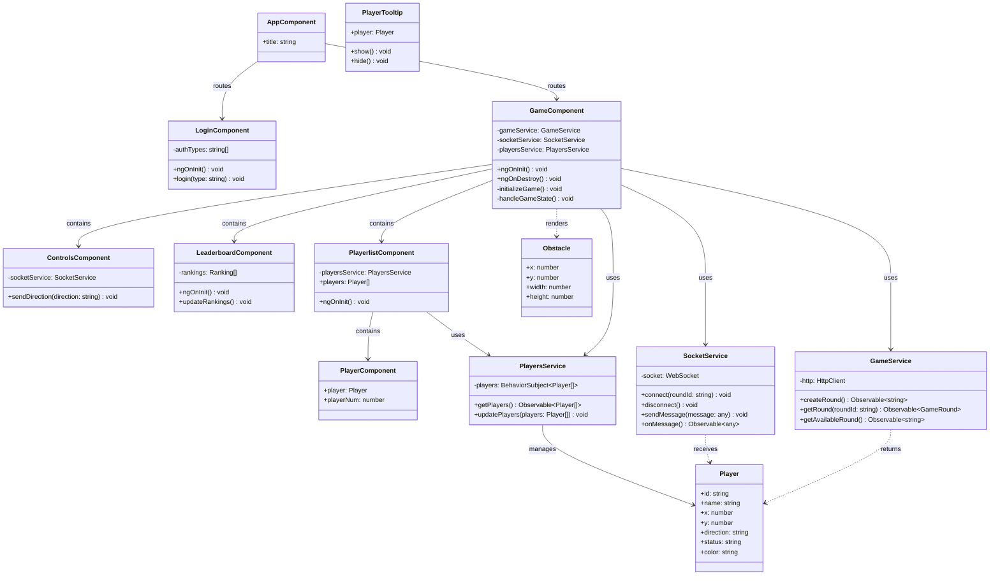
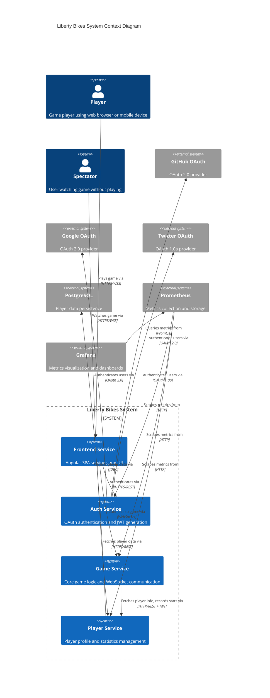

# Liberty Bikes - Comprehensive Technical Analysis

## 1. Project Description

### Overview
Liberty Bikes is a real-time multiplayer game built on microservices architecture using Open Liberty (Jakarta EE) and MicroProfile specifications. The game is a modern take on the classic "Tron light cycles" concept where players control motorcycles that leave trails behind them, and the objective is to avoid crashing into trails, obstacles, or other players.

### Business Domain
- **Target Users**: Casual gamers, developers learning microservices, conference attendees (demo application)
- **Core Functionality**: Real-time multiplayer gaming with WebSocket communication, player authentication via OAuth providers, persistent player statistics, and AI bot opponents
- **Problem Solved**: Demonstrates enterprise Java microservices patterns in an engaging, interactive application

### Technical Stack

**Backend Services:**
- **Runtime**: Open Liberty 19.0.0.9 (Jakarta EE 8 / MicroProfile 3.0)
- **Build Tool**: Gradle 5.x with multi-project setup
- **Language**: Java 8
- **Database**: PostgreSQL 11 (with in-memory fallback)
- **Containerization**: Docker with docker-compose orchestration

**Frontend:**
- **Framework**: Angular 10
- **Language**: TypeScript 3.9
- **UI Library**: Bootstrap 4.5, ng-bootstrap 7.0
- **Graphics**: CreateJS for canvas-based game rendering
- **Build**: Angular CLI with production optimization

**Monitoring & Observability:**
- **Metrics**: Prometheus 2.4.0
- **Visualization**: Grafana 5.2.4
- **Tracing**: MicroProfile OpenTracing (implicit)

### Architecture Overview

**Microservices:**
1. **Auth Service** (Port 8082/8482): OAuth authentication with GitHub, Google, Twitter; JWT token generation
2. **Player Service** (Port 8081): Player profile management, statistics tracking, leaderboard
3. **Game Service** (Port 8080): Core game logic, WebSocket communication, AI bots, game rounds
4. **Frontend Service** (Port 12000): Angular SPA serving static content

**Key Architectural Patterns:**
- Service-to-service communication via MicroProfile REST Client
- JWT-based authentication and authorization
- WebSocket for real-time bidirectional communication
- Event-driven game loop with managed executors
- Fallback patterns for database unavailability
- Shared Liberty installation across all services (optimization)

### Main Objectives
1. Demonstrate MicroProfile specifications in production-ready application
2. Showcase microservices best practices (resilience, observability, security)
3. Provide interactive demo for Open Liberty capabilities
4. Support both desktop and mobile gameplay
5. Enable party-based multiplayer with queue management

---

## 2. Class Diagrams

### Auth Service Class Diagram



### Player Service Class Diagram



### Game Service Class Diagram (Core)



### Game Service Class Diagram (Services & Maps)

```mermaid
classDiagram
    class GameRoundService {
        -boolean isSingleParty
        -Map~String,GameRound~ allRounds
        +listAllGames() Collection~GameRound~
        +createRound() String
        +createRoundById(String gameId) GameRound
        +getAvailableRound() String
        +getRound(String roundId) GameRound
        +requeue(String oldRoundId, boolean isPlayer) String
        +deleteRound(GameRound round) void
    }

    class GameRoundWebsocket {
        -GameRoundService gameSvc
        -PlayerService playerSvc
        +onOpen(String roundId, Session session) void
        +onClose(String roundId, Session session) void
        +onMessage(String roundId, String message, Session session) void
        -closeWithError(Session, String, String) void
        +sendToClient(Session, Object) void
        +sendToClients(Set~Session~, Object) void
    }

    class Party {
        +String id
        -PartyQueue queue
        -GameRound currentRound
        +Party()
        +Party(String id)
        +getCurrentRound() GameRound
        +enqueueClient(String, SseEventSink, Sse) void
        +close() void
        -installCallback(GameRound) void
    }

    class PartyQueue {
        -Party party
        -Map~String,QueuedClient~ queue
        +PartyQueue(Party party)
        +add(String playerId, SseEventSink sink, Sse sse) void
        +promoteClients() void
        +close() void
    }

    class PartyService {
        -Map~String,Party~ allParties
        +createParty() String
        +getParty(String partyId) Party
        +joinParty(String partyId, String playerId) void
    }

    class GameMap {
        <<abstract>>
        #Set~Obstacle~ obstacles
        #Set~MovingObstacle~ movingObstacles
        +getObstacles() Set~Obstacle~
        +getMovingObstacles() Set~MovingObstacle~
        +getPlayerStartingPositions() Point[]
        +create(int mapId)$ GameMap
    }

    class OriginalMap {
        +OriginalMap()
    }

    class EmptyMap {
        +EmptyMap()
    }

    class CrossSlice {
        +CrossSlice()
    }

    class HulkSmash {
        +HulkSmash()
    }

    class Smile {
        +Smile()
    }

    class FakeBlock {
        +FakeBlock()
    }

    class AI {
        <<interface>>
        +processMove(short[][] board) DIRECTION
    }

    class Hal {
        -short playerNum
        +Hal(GameMap map, short playerNum)
        +processMove(short[][] board) DIRECTION
        +asPlayer() Player
    }

    class Wally {
        -short playerNum
        +Wally(GameMap map, short playerNum)
        +processMove(short[][] board) DIRECTION
        +asPlayer() Player
    }

    GameRoundService --> GameRound : manages
    GameRoundWebsocket --> GameRoundService : uses
    GameRoundWebsocket --> PlayerService : calls
    Party --> GameRound : tracks
    Party --> PartyQueue : contains
    PartyService --> Party : manages
    GameMap <|-- OriginalMap
    GameMap <|-- EmptyMap
    GameMap <|-- CrossSlice
    GameMap <|-- HulkSmash
    GameMap <|-- Smile
    GameMap <|-- FakeBlock
    AI <|.. Hal : implements
    AI <|.. Wally : implements
```



### Frontend Angular Architecture



---

## 3. MicroProfile Components Analysis

### MicroProfile Config (mpConfig-1.3)

**Usage Across Services:**

**Auth Service:**
- `@ConfigProperty(name = "jwtKeyStorePassword", defaultValue = "secret")`
- `@ConfigProperty(name = "jwtKeyStoreAlias", defaultValue = "bike")`
- `@ConfigProperty(name = "githubClientId")` - OAuth client ID
- `@ConfigProperty(name = "githubClientSecret")` - OAuth secret
- `@ConfigProperty(name = "googleClientId")`
- `@ConfigProperty(name = "googleClientSecret")`
- `@ConfigProperty(name = "twitterConsumerKey")`
- `@ConfigProperty(name = "twitterConsumerSecret")`

**Game Service:**
- `@ConfigProperty(name = "singleParty", defaultValue = "true")` - Party mode toggle
- JNDI-based config: `round/gameSpeed`, `round/map`, `round/autoStartCooldown`
- Environment variable: `org_libertybikes_restclient_PlayerService_mp_rest_url`

**Player Service:**
- Database connection via environment variables: `DB_HOST`, `DB_PORT`, `DB_NAME`, `DB_USER`, `DB_PASS`

**Configuration Patterns:**
- Externalized configuration for environment-specific values
- Default values for development convenience
- JNDI entries for dynamic runtime configuration
- Environment variables for container orchestration

### MicroProfile Fault Tolerance (mpFaultTolerance-2.0)

**Implementation in Game Service:**

```java
@Retry(maxRetries = 3)
private org.libertybikes.restclient.Player getPlayer(String id) {
    return playerSvc.getPlayerById(id);
}
```

**Usage Pattern:**
- Applied to REST client calls to Player Service
- Automatic retry on transient failures
- Prevents game disruption from temporary service unavailability
- Workaround for MP Rest Client limitation (annotations not directly on interfaces)

**Resilience Strategy:**
- Retry pattern for inter-service communication
- Graceful degradation (AI bots fill empty slots)
- Database fallback (PostgreSQL → in-memory)

### MicroProfile Metrics (mpMetrics-2.0)

**Metrics Implemented:**

**Game Service (GameMetrics class):**
- `total_rounds` (Counter) - Total game rounds created
- `current_rounds` (Counter) - Active game rounds
- `total_players` (Counter) - Total players joined
- `current_players` (Counter) - Currently connected players
- `total_mobile_players` (Counter) - Mobile device players
- `number_of_parties` (Counter) - Total parties created
- `current_parties` (Counter) - Active parties
- `rate_of_websocket_calls` (Meter) - WebSocket message rate
- `open_websocket_duration` (Timer) - WebSocket session duration
- `game_round_duration` (Timer) - Game round execution time

**Player Service:**
- `num_player_logins` (Counter) - Player login count

**Configuration:**
- `<mpMetrics authentication="false"/>` - Metrics endpoint accessible without auth
- Prometheus scraping configured in monitoring/prometheus/prometheus.yml
- Grafana dashboards for visualization

**Observability Benefits:**
- Real-time monitoring of game activity
- Performance tracking (round duration, message rates)
- Capacity planning (concurrent players/rounds)
- User behavior insights (mobile vs desktop)

### MicroProfile OpenAPI (mpOpenAPI-1.1)

**Implementation:**
- Automatic API documentation generation
- Swagger UI available at `/openapi/ui`
- OpenAPI spec at `/openapi`

**Annotations Used:**
```java
@Operation(hidden = true) // Hide internal operations
```

**Services with OpenAPI:**
- Auth Service: OAuth endpoints documented
- Player Service: Player CRUD operations
- Game Service: Round management endpoints

**Benefits:**
- Self-documenting APIs
- Client SDK generation capability
- API testing interface

### MicroProfile REST Client (mpRestClient-1.3)

**Game Service → Player Service Communication:**

```java
@RegisterRestClient(baseUri = "http://localhost:8081/")
@Path("/")
public interface PlayerService {
    @GET
    @Path("/player/{playerId}")
    Player getPlayerById(@PathParam("playerId") String id);
    
    @POST
    @Path("/rank/{playerId}")
    void recordGame(@PathParam("playerId") String id, 
                    @QueryParam("place") int place, 
                    @HeaderParam("Authorization") String token);
}
```

**Injection:**
```java
@Inject
@RestClient
PlayerService playerSvc;
```

**Configuration:**
- Base URI overridden via environment variable
- Type-safe client interface
- Automatic JSON-B serialization/deserialization
- Integration with Fault Tolerance

**Benefits:**
- Eliminates boilerplate HTTP client code
- Compile-time type safety
- Seamless CDI integration
- Testability (mock injection)

### MicroProfile JWT (mpJwt-1.1)

**JWT Flow:**

1. **Auth Service (Token Generation):**
```java
protected String createJwt(Map<String, String> claims) {
    Claims onwardsClaims = Jwts.claims();
    onwardsClaims.putAll(claims);
    onwardsClaims.setSubject(claims.get("id"));
    onwardsClaims.setAudience("client");
    onwardsClaims.setIssuer("https://libertybikes.mybluemix.net");
    return Jwts.builder()
        .setHeaderParam("kid", "bike")
        .setClaims(onwardsClaims)
        .signWith(SignatureAlgorithm.RS256, signingKey)
        .compact();
}
```

2. **Player Service (Token Validation):**
```java
@Inject
private JsonWebToken jwt;

public HashMap<String, String> getJWTInfo() {
    String id = jwt.getClaim("id");
    // Use JWT claims
}
```

**Configuration:**
```xml
<mpJwt id="myMpJwt" 
       keyName="rebike" 
       issuer="https://libertybikes.mybluemix.net" 
       audiences="client"
       authFilterRef="appFilter"/>
```

**Security Architecture:**
- RS256 (RSA) signing algorithm
- Keystore-based key management
- Different keystore passwords per service
- Auth filter to exclude admin endpoints
- 24-hour token validity

**Claims Used:**
- `id` - Player identifier
- `upn` - User principal name
- `groups` - Authorization groups
- `iss` - Issuer
- `aud` - Audience
- `exp` - Expiration

### MicroProfile Health (Not Explicitly Implemented)

**Note:** While MicroProfile Health is not explicitly implemented in the codebase, the infrastructure supports it through:
- Liberty feature availability
- Kubernetes/Cloud readiness
- Monitoring integration points

### MicroProfile OpenTracing (Not Explicitly Implemented)

**Note:** OpenTracing is not explicitly configured but could be added via:
- Liberty feature: `mpOpenTracing-1.3`
- Jaeger integration
- Distributed tracing across services

---

## 4. System Context Diagram (C4 Model)



### System Interactions Detail

**Authentication Flow:**
1. Player clicks OAuth provider button in Frontend
2. Frontend redirects to Auth Service `/auth/{provider}`
3. Auth Service redirects to OAuth provider (GitHub/Google/Twitter)
4. OAuth provider authenticates user and redirects back with code
5. Auth Service exchanges code for access token
6. Auth Service fetches user info from OAuth provider
7. Auth Service generates JWT with player claims
8. Auth Service redirects to Frontend with JWT
9. Frontend stores JWT for subsequent requests

**Game Session Flow:**
1. Player authenticates and receives JWT
2. Frontend calls Player Service to create/fetch player profile (JWT in header)
3. Frontend calls Game Service to create or join game round
4. Frontend establishes WebSocket connection to Game Service
5. Game Service validates player via REST call to Player Service (with retry)
6. Players send direction commands via WebSocket
7. Game Service broadcasts game state updates to all connected clients
8. On game end, Game Service records statistics to Player Service (JWT auth)

**Data Flows:**
- **Player → Frontend**: User input (keyboard/touch), authentication credentials
- **Frontend → Auth**: OAuth requests, callback handling
- **Frontend → Game**: WebSocket messages (join, direction, spectate)
- **Frontend → Player**: REST API calls (profile, leaderboard)
- **Game → Player**: REST API calls (player lookup, stats recording)
- **Auth → OAuth Providers**: OAuth flows (authorization, token exchange, user info)
- **Player → PostgreSQL**: JDBC queries (CRUD operations)
- **All Services → Prometheus**: Metrics exposition (pull model)
- **Grafana → Prometheus**: Metrics queries (PromQL)

**Security Boundaries:**
- **Public Zone**: Frontend (port 12000), Auth Service (port 8082)
- **Internal Zone**: Game Service (port 8080), Player Service (port 8081)
- **Data Zone**: PostgreSQL (port 5432)
- **Monitoring Zone**: Prometheus (port 9090), Grafana (port 3000)

**Authentication & Authorization:**
- OAuth providers authenticate user identity
- Auth Service issues JWT tokens
- Player Service validates JWT for protected endpoints
- Game Service uses service-to-service JWT for Player Service calls
- Frontend includes JWT in Authorization header for API calls

**High-Level Responsibilities:**

**Frontend Service:**
- Serve static Angular application
- Render game graphics (Canvas/CreateJS)
- Manage WebSocket connections
- Handle user input and controls
- Display leaderboards and player lists

**Auth Service:**
- OAuth integration (GitHub, Google, Twitter)
- JWT token generation and signing
- User identity verification
- Redirect handling for OAuth flows

**Game Service:**
- Game round lifecycle management
- Real-time WebSocket communication
- Game physics and collision detection
- AI bot opponents (Hal, Wally)
- Party and queue management
- Moving obstacles and dynamic maps

**Player Service:**
- Player profile CRUD operations
- Statistics tracking (wins, losses, score)
- Leaderboard generation
- Database abstraction (PostgreSQL/in-memory)
- JWT claim extraction

**External Dependencies:**
- **OAuth Providers**: User authentication
- **PostgreSQL**: Persistent storage (optional)
- **Prometheus**: Metrics aggregation
- **Grafana**: Operational dashboards

---

## Summary

Liberty Bikes is a sophisticated microservices application demonstrating enterprise Java patterns through an engaging multiplayer game. The architecture leverages MicroProfile specifications for configuration, resilience, metrics, security, and inter-service communication. The system exhibits production-ready patterns including graceful degradation, retry logic, comprehensive observability, and flexible deployment options (local, Docker, cloud).

Key technical achievements:
- Real-time multiplayer via WebSocket with sub-50ms tick rate
- OAuth integration with multiple providers
- JWT-based security across services
- Automatic failover (database, service calls)
- Comprehensive metrics and monitoring
- Mobile and desktop support
- AI bot opponents for single-player experience
- Party-based matchmaking with queue management

The codebase serves as an excellent reference implementation for developers learning microservices, MicroProfile, and Open Liberty.